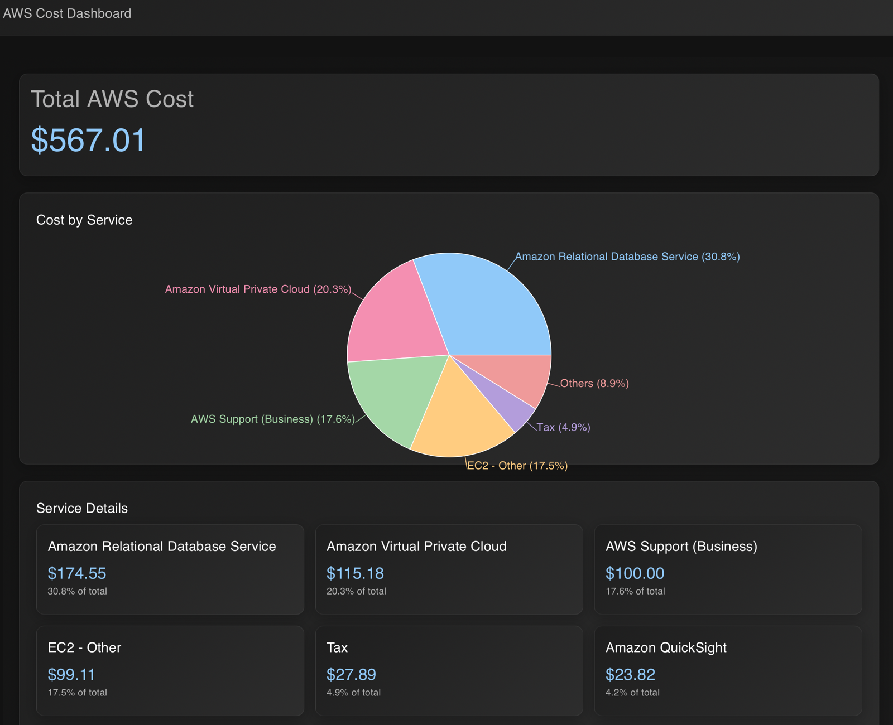

# AWS Cost Dashboard

A modern, dark-themed dashboard for visualizing your AWS costs across different services. Built with React, TypeScript, and Material-UI.



## Features

- 🌙 Modern dark theme interface with smooth animations
- 💰 Real-time AWS cost analysis (last 30 days)
- 📊 Interactive pie chart showing top 5 services by cost
- 📑 Detailed breakdown of costs per service with percentage distribution
- 🔍 Drill-down capability into usage types for each service
- 💫 Smooth animations and transitions for better UX
- 📱 Fully responsive design for all screen sizes
- 🎨 Custom-styled scrollbars and tooltips

## Prerequisites

Before you begin, ensure you have the following installed:
- Node.js (v16 or higher recommended)
- npm (v7 or higher recommended)
- AWS CLI (configured with appropriate credentials)

## AWS Credentials Setup

1. Configure your AWS CLI with credentials that have Cost Explorer access:
   ```bash
   aws configure
   ```
   - Enter your AWS Access Key ID
   - Enter your AWS Secret Access Key
   - Set default region (e.g., us-west-2)
   - Set output format (json recommended)

2. Create a `.env` file in the root directory with the following content:
   ```
   REACT_APP_AWS_REGION=your_aws_region
   REACT_APP_AWS_ACCESS_KEY_ID=your_access_key_id
   REACT_APP_AWS_SECRET_ACCESS_KEY=your_secret_access_key
   ```

3. Required IAM Permissions:
   ```json
   {
     "Version": "2012-10-17",
     "Statement": [
       {
         "Effect": "Allow",
         "Action": [
           "ce:GetCostAndUsage"
         ],
         "Resource": "*"
       }
     ]
   }
   ```

## Installation

1. Clone the repository:
   ```bash
   git clone https://github.com/yourusername/aws-cost-dashboard.git
   cd aws-cost-dashboard
   ```

2. Install dependencies:
   ```bash
   npm install
   ```

3. Start the development server:
   ```bash
   npm start
   ```

4. Open [http://localhost:3000](http://localhost:3000) to view the dashboard in your browser.

## Application Structure

```
src/
├── components/          # React components
│   └── Dashboard.tsx    # Main dashboard component with pie chart and service details
├── services/           
│   └── awsService.ts   # AWS Cost Explorer integration and data processing
├── App.tsx             # Root component with theme configuration
└── index.tsx           # Application entry point
```

## How It Works

The dashboard provides a visual representation of your AWS costs with the following features:

1. **Total AWS Cost Card**
   - Displays the total cost across all services
   - Shows data for the last 30 days by default
   - Updates automatically when data is refreshed

2. **Cost by Service Visualization**
   - Interactive pie chart showing cost distribution
   - Displays top 5 services by cost with percentages
   - Groups smaller costs into "Others" category
   - Hover tooltips with detailed cost information
   - Custom color scheme for better visibility

3. **Service Details**
   - Clickable service cards showing individual service costs
   - Percentage of total cost for each service
   - Modal view with scrollable usage type breakdown
   - Animated transitions and hover effects
   - Responsive grid layout

## AWS Cost Explorer Integration

The application uses the AWS Cost Explorer API to fetch cost data. It requires the following permission:
- `ce:GetCostAndUsage`

The data is fetched for the last 30 days and includes:
- Service-level cost breakdown
- Usage type details per service
- Daily cost aggregation

## Security Considerations

- Never commit your `.env` file containing AWS credentials
- Use appropriate IAM roles with minimum required permissions
- Consider using AWS Cognito or similar for user authentication
- Regularly rotate AWS access keys
- Use environment variables for sensitive configuration
- Implement proper error handling for API failures

## Contributing

1. Fork the repository
2. Create your feature branch (`git checkout -b feature/AmazingFeature`)
3. Commit your changes (`git commit -m 'Add some AmazingFeature'`)
4. Push to the branch (`git push origin feature/AmazingFeature`)
5. Open a Pull Request

## License

This project is licensed under the MIT License - see the LICENSE file for details.

## Support

For support, please open an issue in the GitHub repository or contact the maintainers.

## Troubleshooting

Common issues and solutions:
- If costs aren't showing, verify your AWS credentials and permissions
- For performance issues, ensure you're using a modern browser
- If the pie chart isn't rendering, check your window size and try refreshing
